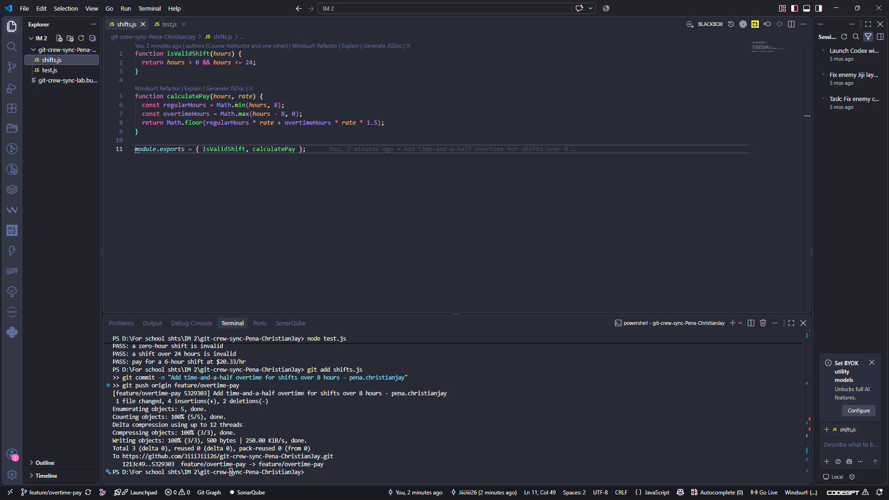
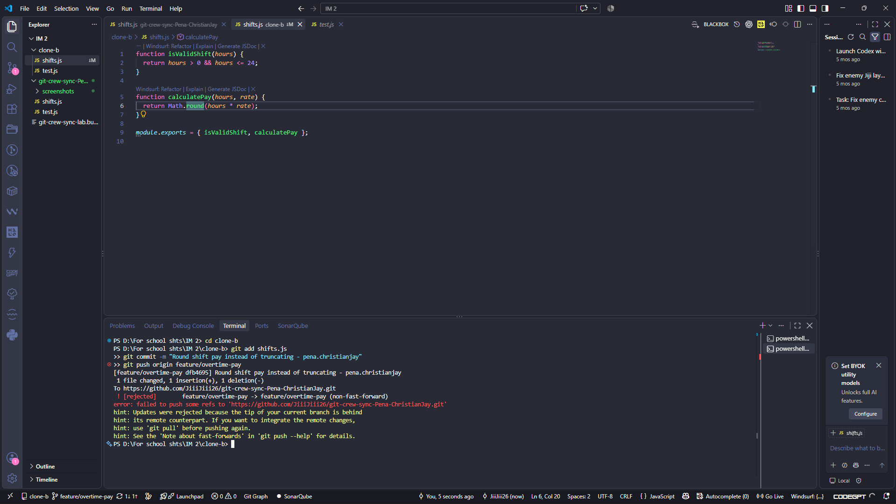
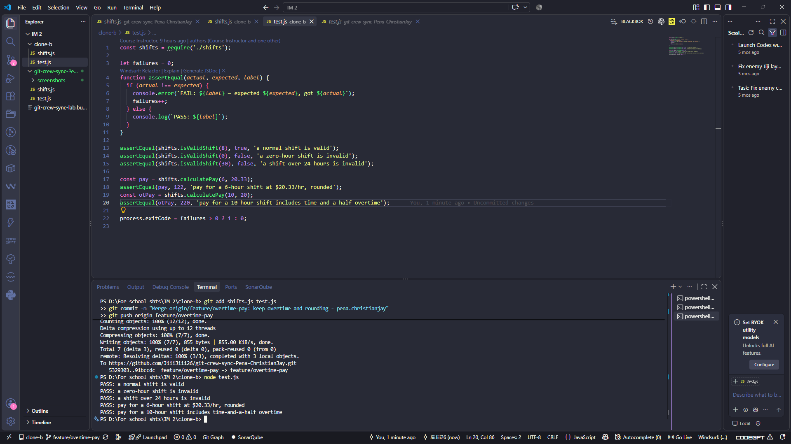
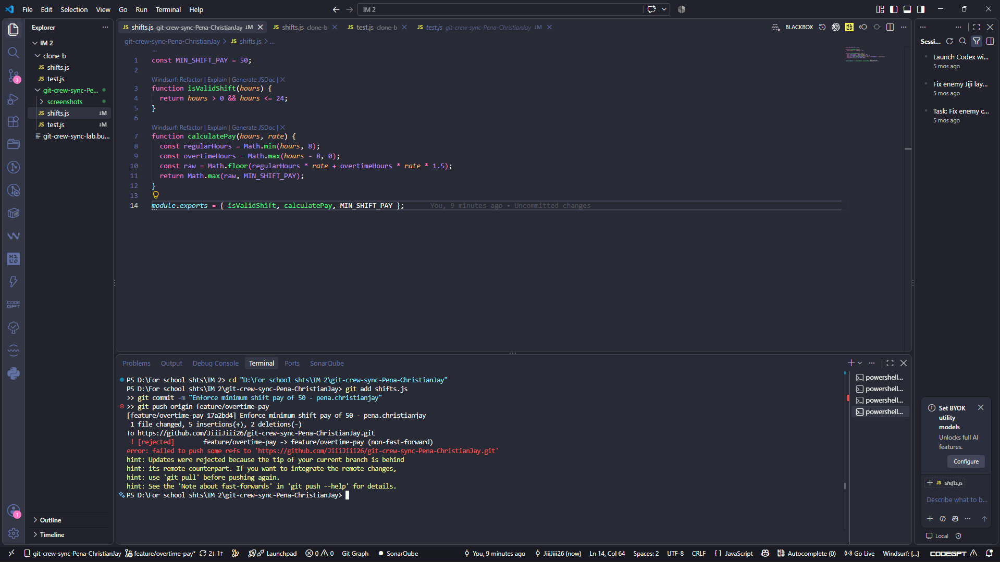
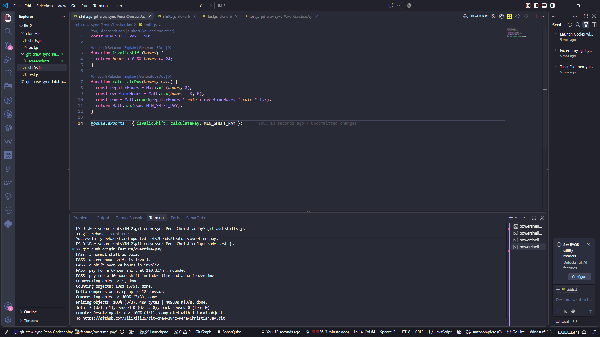
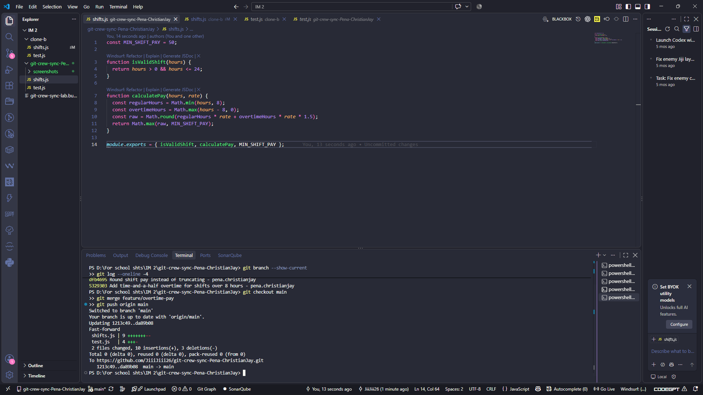
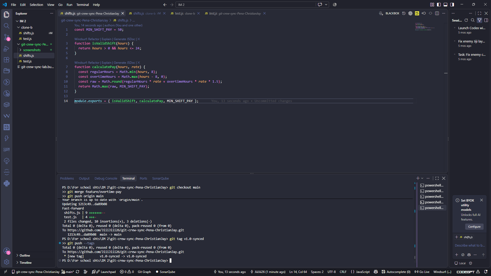
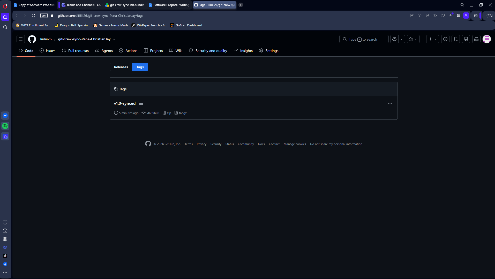

# Crew Sync — WORKFLOW

## Task 1 — Overtime pay pushed from Clone A
Added time-and-a-half overtime for shifts over 8 hours in `calculatePay`, committed and pushed from Clone A.

**Task 1 evidence**

## Task 2 — Rejected push from Clone B
Clone B made a different change to the same function (round instead of floor) without fetching Clone A's push. The push was rejected as non-fast-forward.

**Task 2 evidence**

## Task 3 — Reconcile with a merge (Clone B)
Fetched and merged Clone A's change. Resolved the conflict so both overtime and rounding behaviors survive. Tests updated to match (rounded pay = 122, overtime = 220). Pushed successfully.

**Task 3 evidence**Get-ChildItem WORKFLOW.md

## Task 4 — Reconcile with a rebase (Clone A)
Clone A made one more change to `calculatePay` (minimum shift pay floor) without fetching first, so the push was rejected again. Reconciled with `git fetch` + `git rebase` instead of merge. Resolved the conflict, continued the rebase, and pushed without `--force`.

**Task 4 evidence — rejection**

**Task 4 evidence — rebase resolution and push**

## Task 5 — Merged feature branch into main
Fast-forward merge of `feature/overtime-pay` into `main`, pushed to GitHub.

**Task 5 evidence**

## Task 6 — Tagged v1.0-synced
Tagged the final commit `v1.0-synced` and pushed tags.

**Task 6 evidence — terminal tag push**

**Task 6 evidence — GitHub tags page**

---

## Reflection

### 1. What did the rejected push error message tell you, and why did it happen?
The message was a `! [rejected] ... (non-fast-forward)` error with the hint:
_"Updates were rejected because the tip of your current branch is behind its remote counterpart. Integrate the remote changes before pushing again."_

It happened because my local branch was based on an older commit than the remote branch. Git refuses to fast-forward on the server when the pushed commit is not a descendant of the current remote tip — pushing as-is would have discarded the work already on the remote. I had to integrate the remote's newer commits (via merge or rebase) before my push could be a fast-forward.

### 2. What's the actual difference between how you resolved Task 3 (merge) vs Task 4 (rebase)?
In Task 3 I used `git fetch` + `git merge`, which created a **merge commit** tying the two divergent histories together. The result is a non-linear history with two parents — you can see the fork in `git log --graph`. My conflict resolution was captured in that merge commit.

In Task 4 I used `git fetch` + `git rebase`, which **replayed** my one local commit on top of the remote's tip. The result is a linear history with no merge commit — my "Enforce minimum shift pay of 50" commit now sits directly on top of Clone B's merge commit. The conflict was resolved during the replay, then I ran `git rebase --continue`.

Functionally both produce the same final file contents. The difference is history shape: merge preserves divergence and adds a commit; rebase rewrites local commits to look like they were always based on the newest remote tip.

### 3. What one habit would have avoided both rejected pushes in this lab?
**Fetching (or pulling) before pushing.** If Clone B had run `git fetch` + `git rebase origin/feature/overtime-pay` (or `git pull --rebase`) before its push in Task 2, git would have surfaced the divergence locally and I would have resolved the conflict before even attempting to publish. Same for Clone A in Task 4. The rejection only happens at push time; a fetch beforehand moves that discovery earlier and turns the "rejected push" into an ordinary local merge/rebase.

### 4. Which approach — merge or rebase — would you default to on a shared team branch, and why?
**Rebase for my own unpublished local commits; merge when integrating into a shared branch.**

- On my own feature branch, before pushing, I'd `git pull --rebase` to keep my commits on top of the latest remote work — this keeps the history linear and readable, and no one else has my commits yet, so rewriting them is safe.
- Once a branch is published and teammates might have based work on it (like `main` or a long-lived `feature/overtime-pay` that others are pulling), I'd use **merge**. Rewriting published history breaks everyone else's clones and forces awkward force-pushes.

The rule of thumb: **rebase private work, merge shared work.** In this lab I used merge for integrating Clone A's published work into Clone B's branch (Task 3), and rebase for replaying my own unpublished local commit on top of the remote (Task 4) — which matches that rule.